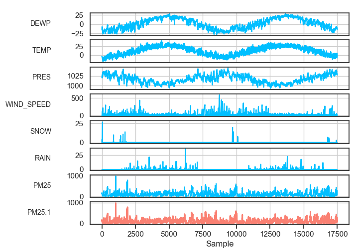
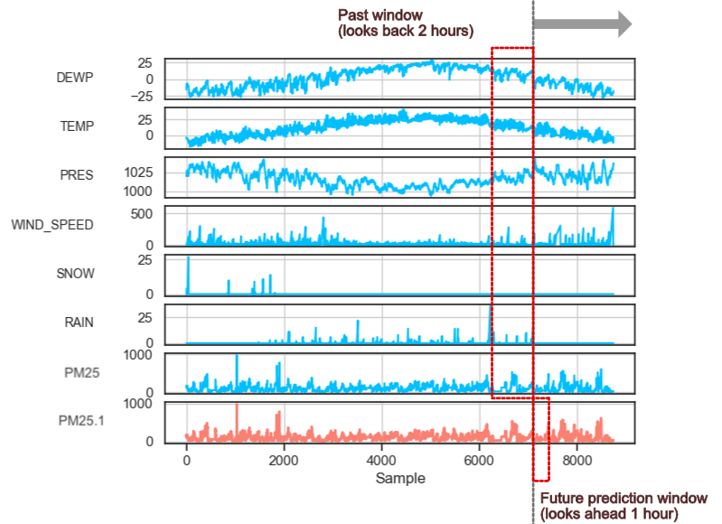
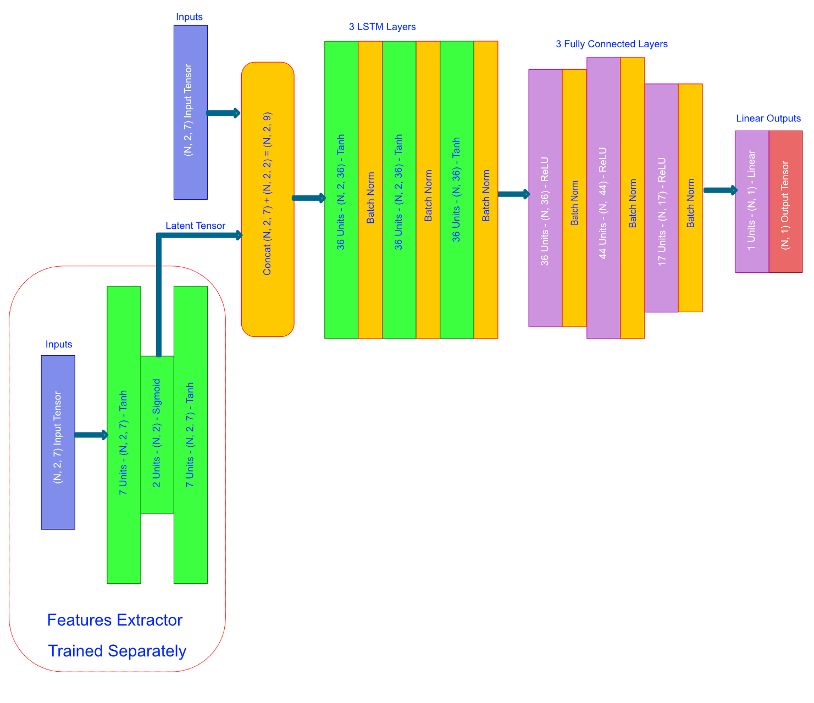
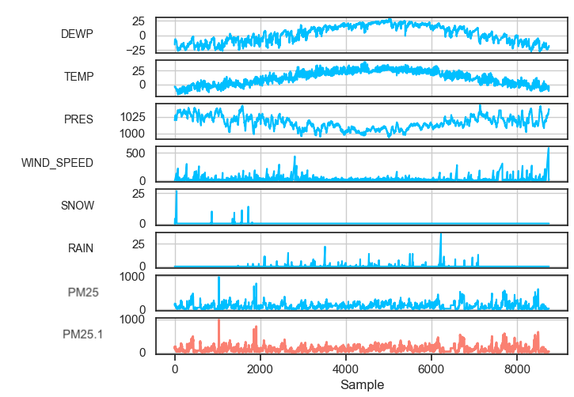
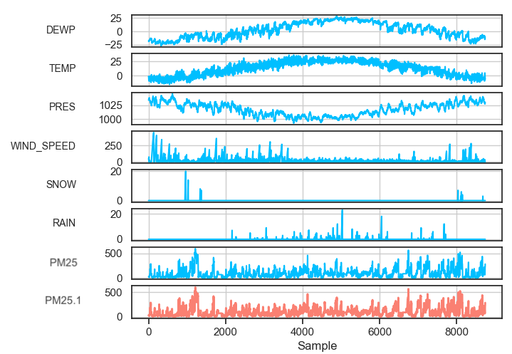
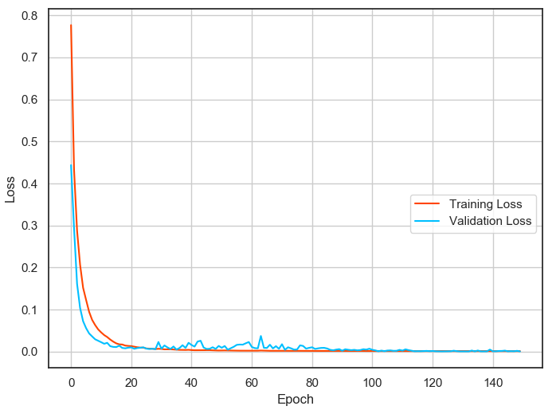
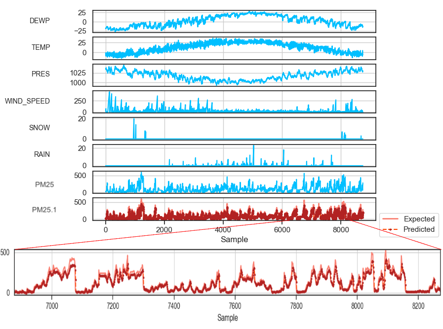

## Tutorial 2 - Forecasting Air Quality (*Multi-Variable Regression With Auto Features Extraction*)

In this tutorial, we learn how to use [tsf](https://github.com/tuantle/tsf) tool to forecast hourly air pollution. This tutorial focuses on multi-variable regression modeling that will be trained using the [Beijing air quality dataset.](https://archive.ics.uci.edu/ml/datasets/Beijing+PM2.5+Data).

### Raw Dataset Processing

Here are the first few rows of the raw dataset. Just like the previous tutorial, we need to clean up the raw CSV dataset and rearrange the columns.

| No | year | month | day | hour | pm2.5 | DEWP | TEMP | PRES | cbwd | Iws  | Is | Ir |
|----|------|-------|-----|------|-------|------|------|------|------|------|----|----|
| 25 | 2010 | 1     | 2   | 0    | 129   | -16  | -4   | 1020 | SE   | 1.79 | 0  | 0  |
| 26 | 2010 | 1     | 2   | 1    | 148   | -15  | -4   | 1020 | SE   | 2.68 | 0  | 0  |
| 27 | 2010 | 1     | 2   | 2    | 159   | -11  | -5   | 1021 | SE   | 3.57 | 0  | 0  |

We will have to remove the **year**, **month**, and **day** columns as they are not needed. **cbwd** is the wind direction and **Iws** is wind speed. We only need the wind speed so wind direction column will be removed.
**Is** is snow data and **Ir** is rain and **pm2.5** is what we are going to forecast so it will be moved to the last column. The original dataset has more than 2 years of dataset. We will only use 1 year of data for this tutorial.
After processing and cleaning up, the dataset should looks like so.

| N | DEWP | TEMP | PRES | WIND_SPEED | SNOW | RAIN | PM25 | PM25 |
|---|------|------|------|------------|------|------|------|------|
| 1 | -16  | -4   | 1020 | 1.79       | 0    | 0    | 129  | 129  |
| 2 | -15  | -4   | 1020 | 2.68       | 0    | 0    | 148  | 148  |
| 3 | -11  | -5   | 1021 | 3.57       | 0    | 0    | 159  | 159  |

And the plot of the processed [dataset](https://github.com/tuantle/tsf/blob/master/examples/air_quality/datasets/training_dataset.csv)



### Setup & Training Strategy

This is a multi-variable regression modeling tutorial with 7 input features to feed into our model and 1 prediction output from the model.

The training strategy is to look back at the previous 2 hours of input data and and make forecast for next hour **PM25** pollution level.

Thus the input of the model would be a tensor of shape = (N, 2, 7), where N = batch size, 2 = past 2 hours window, and 7 = feature count.

The output from the model would then be a tensor of shape (N, 1, 1), where N = batch size, 1 = next hour future window, and 1 = prediction count.

Below is a visual diagram of the feature-prediction sliding windows during training (*the windows are not drawn to scale*).



And an example of the data points inside feature-prediction sliding windows. This assume batch size = 1.
Here we feed in feature data in rows 1 to 2, columns 1 to 7 and expect the model to predict **PM25** in row 3, column 8.

| N | DEWP      | TEMP     | PRES       | WIND_SPEED | SNOW    | RAIN    | PM25      | PM25      |
|---|-----------|----------|------------|------------|---------|---------|-----------|-----------|
| 1 |    -16    |    -4    |    1020    |    1.79    |    0    |    0    |    129    | ...       |
| 2 |    -15    |    -4    |    1020    |    2.68    |    0    |    0    |    148    | ...       |
| 3 | ...       | ...      | ...        | ...        | ...     | ...     | ...       |    159    |

### Setup Model

For this multi-variable classification tutorial, we will use a different strategy for modeling and training. [tsf](https://github.com/tuantle/tsf) has an auto features extraction capability that we can use to improve model training and possibly improve the model forecasting performance. What the auto features extraction does is compressing the original features of our dataset and extract the meaningful compressed representations. A simple recurrent auto-encoder will be used for this task. We will then concatenate the original features and the extracted features together and feed that into our main model. [tsf](https://github.com/tuantle/tsf) will handle all this processes internally.

As for our main model, a simple DNN with 3 LSMT and 3 Dense or fully connected layers should be adequate. And to improve training and reduce overfitting, we will set dropout rate at 20%, input regularization (*L1L2 regularization at input layer*) at 0.002 and enable batch normalization for input and hidden layers.

And below is the architecture diagram of the model generated by [tsf](https://github.com/tuantle/tsf).



Note the activation of the compressed latent layer is a Sigmoid. This is because we want to extracted features to be normalized between 0 and 1.

The number of LSTM units and Dense units are automatically determined by [tsf](https://github.com/tuantle/tsf) based on the number of features and predictions. To hand pick these unit sizes, you can modification to [compiler.py](https://github.com/tuantle/tsf/blob/master/src/compiler.py) at lines 235 - 250. ReLU activation is used for Dense layer and Tanh for LSTM as default with Adam optimizer. The weights for every layers are initialized with Glorot random normal.

Here is the console run command to compile the model to HDF5 with Keras & Tensorflow backend.

```
python3 tsf.py -a compile -o lcl -m examples/air_quality/models/model_33_2_71 -rl 3 -dl 3 -ir 0.002 -dr 0.2 -bn -w 2 -f 7 -ef 2 -p 1 -v
```
```
Params desc:
-a compile      # Do model compilation
-m ""           # Output compiled model filename
-o mse          # Use mean square error as model objective loss function
-opt adam       # Using Adam optimizer
-rl 3           # Building 3 recurrent (lstm) layers
-dl 3           # and 3 fully connected (dense) layers
-w 2            # We want to look back at the past 2 hours, so the window is 2
-dr 0.2         # 20% dropout rate.
-ir 0.002       # input layer l1l2 regularization value set at 0.002
-bn             # Enable batch normalization
-f 7            # 7 input features
-ef 2           # Enable features extraction and extract 2 features from the original 7
-p 1            # 1 output prediction
-v              # show model summary at the end
```

And below is the model summary after compilation.

```
Auto Features Extraction Autoencoder Model
_________________________________________________________________
Layer (type)                 Output Shape              Param #
=================================================================
autoencoder_input_layer (Inp (None, 2, 7)              0
_________________________________________________________________
encoder_input_layer (LSTM)   (None, 2, 7)              420
_________________________________________________________________
encoder_output_layer (LSTM)  (None, 2)                 80
_________________________________________________________________
autoencoder_latent_output_la (None, 2, 2)              0
_________________________________________________________________
decoder_input_layer (LSTM)   (None, 2, 2)              40
_________________________________________________________________
decoder_output_layer (LSTM)  (None, 2, 7)              280
=================================================================
Total params: 820
Trainable params: 820
Non-trainable params: 0
_________________________________________________________________


Main Model
_________________________________________________________________
Layer (type)                 Output Shape              Param #
=================================================================
lstm_input_layer (LSTM)      (None, 2, 36)             6624
_________________________________________________________________
activation_1 (Activation)    (None, 2, 36)             0
_________________________________________________________________
batch_normalization_1 (Batch (None, 2, 36)             144
_________________________________________________________________
lstm_hidden_layer_1 (LSTM)   (None, 2, 36)             10512
_________________________________________________________________
activation_2 (Activation)    (None, 2, 36)             0
_________________________________________________________________
batch_normalization_2 (Batch (None, 2, 36)             144
_________________________________________________________________
lstm_output_layer (LSTM)     (None, 36)                10512
_________________________________________________________________
activation_3 (Activation)    (None, 36)                0
_________________________________________________________________
batch_normalization_3 (Batch (None, 36)                144
_________________________________________________________________
dense_input_layer (Dense)    (None, 36)                1332
_________________________________________________________________
activation_4 (Activation)    (None, 36)                0
_________________________________________________________________
batch_normalization_4 (Batch (None, 36)                144
_________________________________________________________________
dropout_1 (Dropout)          (None, 36)                0
_________________________________________________________________
dense_hidden_layer_1 (Dense) (None, 44)                1628
_________________________________________________________________
activation_5 (Activation)    (None, 44)                0
_________________________________________________________________
batch_normalization_5 (Batch (None, 44)                176
_________________________________________________________________
dropout_2 (Dropout)          (None, 44)                0
_________________________________________________________________
dense_hidden_layer_2 (Dense) (None, 17)                765
_________________________________________________________________
activation_6 (Activation)    (None, 17)                0
_________________________________________________________________
batch_normalization_6 (Batch (None, 17)                68
_________________________________________________________________
dropout_3 (Dropout)          (None, 17)                0
_________________________________________________________________
dense_output_layer (Dense)   (None, 1)                 18
_________________________________________________________________
activation_7 (Activation)    (None, 1)                 0
=================================================================
Total params: 32,211
Trainable params: 31,801
Non-trainable params: 410
_________________________________________________________________
```

### Train Model

For training, we are going to split the dataset into 2 parts. Because we have 2 years worth of data, 50% will be for validation (year 2) and 50% for training (year 1). So in other words, using year 1 dataset for training the model and then using the trained model to predict pollution levels of year 2.
The auto features extraction model, on the other hand, are being train with the entire dataset (2 years). This is done first before training the main model.

Here is the training dataset for year 1.



Here is the validation dataset for year 2.



We will train the model for 150 epoch with batch size = 1024 and initial learning rate at 0.005. Learning rate step decay annealing is automatically apply by [tsf](https://github.com/tuantle/tsf) during training. Start the training with the command below.

```
python3 tsf.py -a train -ds examples/air_quality/datasets/training_dataset.csv -m examples/air_quality/models/model_33_2_71.h5 -vs 0.5 -w 2 -f 7 -p 1 -ep 150 -b 1024 -ilr 0.005 -v
```
```
Params desc:
-a train        # Do model training
-vs 0.5         # Validation / training dataset split at 50% and 50%
-w 2            # Past 2 hours window
-ep 150         # Setting epoch at 150
-b 1024         # Setting batch size at 1024
-ilr 0.005      # Starting learning rate at 0.005
-f 7            # 7 input feature
-p 1            # 1 output prediction
-v              # Show plots and results
```

Since we have auto features extraction enabled, below are the 2 extracted features for the whole dataset (2 years).


Here is the training & validation loss after 100 epochs.



### Results

Here is the model output results for the validation dataset. The expected and predicted **PM25** level are plot on top of each other. This might looks like a case of overfitting since the prediction is very well matched with the expectation, but this is not the dataset that the model was trained with. This is the validation dataset, so the model is doing a decent job at making predictions for next hour pollution level.



----

[Next Tutorial - Forecasting Room Occupancy (*Multi-Variable Classification*)](https://github.com/tuantle/tsf/blob/master/examples/occupancy/TUTORIAL.md)
