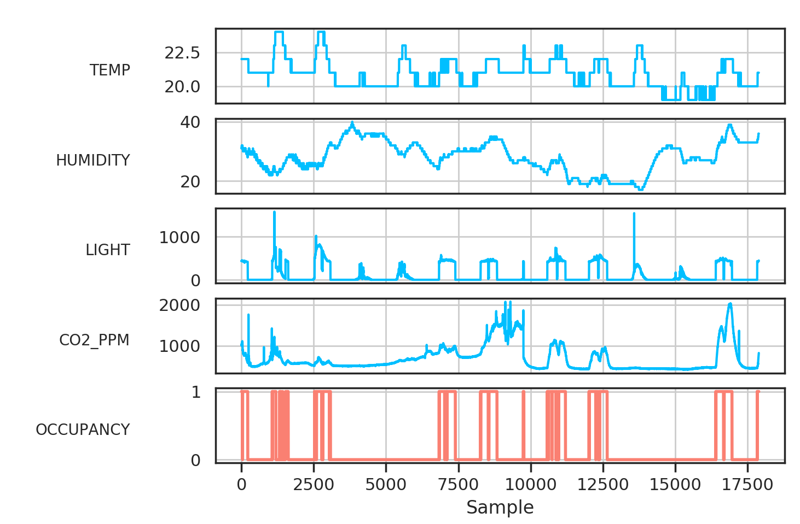
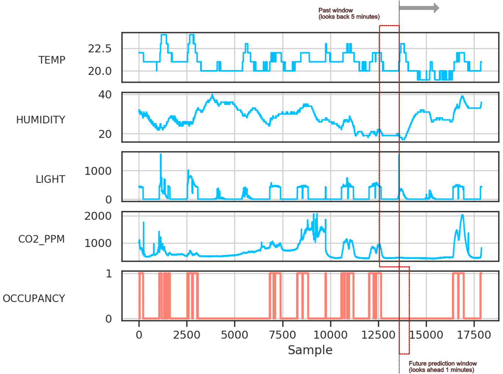
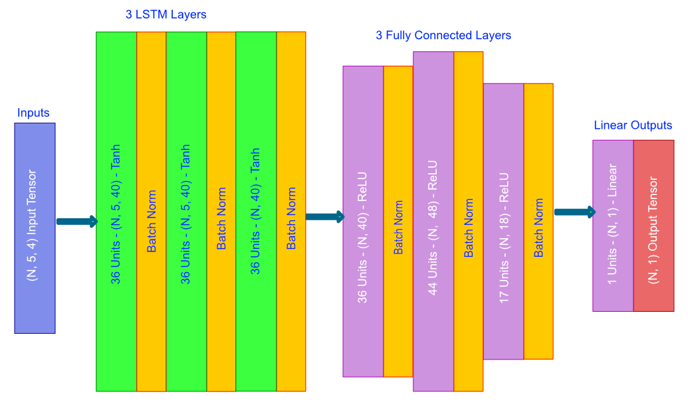
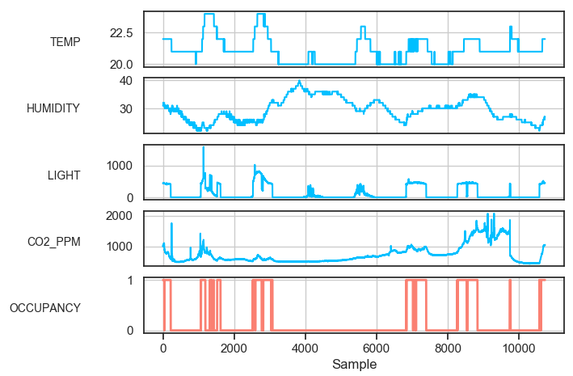
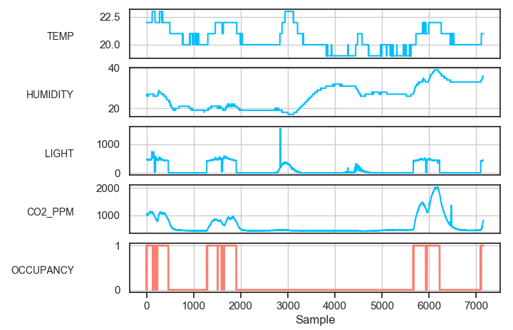
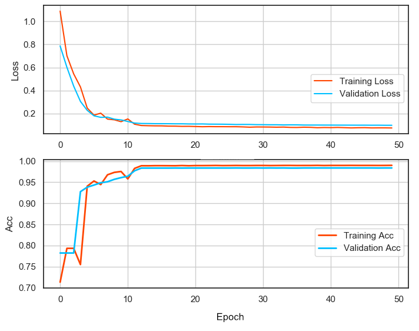
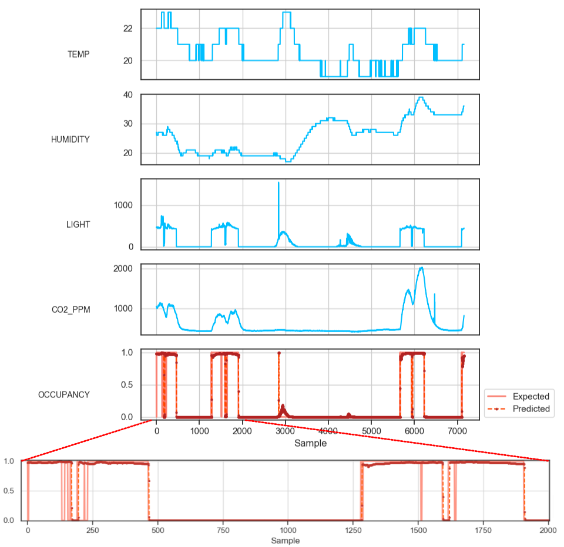

## Tutorial 3 - Forecasting Room Occupancy (*Multi-Variable Classification*)

This tutorial focuses on multi-variable classification modeling and we learn how to predict room occupancy with [tsf](https://github.com/tuantle/tsf) tool. We will be using [room occupancy detection dataset](https://archive.ics.uci.edu/ml/datasets/Occupancy+Detection+) for training and testing.

### Raw Dataset Processing

Room occupancy detection dataset contains information such as temperature, humidity, CO2 level, and light level.
Here are the first few rows of the raw dataset. Just like the previous tutorial, we need to clean up the raw CSV dataset and rearrange the columns.

| date                | Temperature | Humidity | Light | CO2   | HumidityRatio | Occupancy |
|---------------------|-------------|----------|-------|-------|---------------|-----------|
| 2015-02-02 14:19:00 | 23.7        | 26.272   | 585.2 | 749.2 | 0.0048        | 1         |
| 2015-02-02 14:19:59 | 23.718      | 26.29    | 578.4 | 760.4 | 0.0048        | 1         |
| 2015-02-02 14:21:00 | 23.73       | 26.23    | 572.7 | 769.7 | 0.0048        | 1         |

We do not need **date** data so that column will be removed. We also don't need **HumidityRatio** and that will be removed too. Data point precision is not important for this type of modeling, so we will round them all to integer. After processing and cleaning up, the dataset would have 4 features and 1 prediction, and it would look like so.

| N | TEMP | HUMIDITY | LIGHT | CO2_PPM | OCCUPANCY |
|---|------|----------|-------|---------|-----------|
| 1 | 24   | 26       | 585   | 749     | 1         |
| 2 | 24   | 26       | 578   | 760     | 1         |
| 3 | 24   | 26       | 573   | 770     | 1         |

And the plot of the processed [dataset](https://github.com/tuantle/tsf/blob/master/examples/occupancy/datasets/training_dataset.csv)



### Setup & Training Strategy

Just like the previous tutorials, the training strategy is to look back at the previous 5 minutes of feature data and to make forecast for room occupancy in the next minute.

Thus the input of the model would be a tensor of shape = (N, 5, 4), where N = batch size, 5 = past 5 minutes window, and 4 = feature count.

The output from the model would then be a tensor of shape (N, 1, 1), where N = batch size, 1 = next minute future window, and 1 = prediction count.

Below is a visual diagram of the feature-prediction sliding windows during training (*the windows are not drawn to scale*).



And an example of the data points inside feature-prediction sliding windows. This assume batch size = 1.
Here we feed in feature data in rows 1 to 5, columns 1 to 4 and expect the model to predict **OCCUPANCY** in row 6, column 5.

| N | TEMP | HUMIDITY | LIGHT | CO2_PPM | OCCUPANCY |
|---|------|----------|-------|---------|-----------|
| 1 | 22   | 31       | 437   | 1030    | ...       |
| 2 | 22   | 31       | 437   | 1000    | ...       |
| 3 | 22   | 31       | 434   | 1004    | ...       |
| 4 | 22   | 31       | 439   | 1010    | ...       |
| 5 | 22   | 31       | 437   | 1006    | ...       |
| 6 | ...  | ...      | ...   | ...     | 1         |

### Setup Model

For this classification forecasting tutorial, we will build a model with 3 LSMT and 3 Dense or fully connected layers. And to improve training, we will set dropout rate at 20%, input regularization (*L1L2 regularization at input layer*) at 0.01 and enable batch normalization for input and hidden layers.

And below is the architecture diagram of the model generated by [tsf](https://github.com/tuantle/tsf).



Here is the console run command to compile the model to HDF5 with Keras & Tensorflow backend.

```
python3 tsf.py -a compile -o bce -m examples/occupancy/models/model_33_5_41 -rl 3 -dl 3 -ir 0.01 -dr 0.2 -w 5 -f 4 -p 1 -v
```
```
Params desc:
-a compile      # Do model compilation
-m ""           # Output compiled model filename
-o bce          # Use binary crossentropy as model objective loss function
-opt adam       # Using Adam optimizer
-rl 3           # Building 3 recurrent (lstm) layers
-dl 3           # and 3 fully connected (dense) layers
-w 5            # We want to look back at the past 5 minutes, so the window is 5
-dr 0.2         # 20% dropout rate.
-ir 0.01        # input layer l1l2 regularization value set at 0.01
-bn             # Enable batch normalization
-f 4            # 4 input features
-p 1            # 1 output prediction
-v              # show model summary at the end
```

And below is the model summary after compilation.

```
_________________________________________________________________
Layer (type)                 Output Shape              Param #
=================================================================
lstm_input_layer (LSTM)      (None, 5, 40)             7200
_________________________________________________________________
activation_1 (Activation)    (None, 5, 40)             0
_________________________________________________________________
lstm_hidden_layer_1 (LSTM)   (None, 5, 40)             12960
_________________________________________________________________
activation_2 (Activation)    (None, 5, 40)             0
_________________________________________________________________
lstm_output_layer (LSTM)     (None, 40)                12960
_________________________________________________________________
activation_3 (Activation)    (None, 40)                0
_________________________________________________________________
dense_input_layer (Dense)    (None, 40)                1640
_________________________________________________________________
activation_4 (Activation)    (None, 40)                0
_________________________________________________________________
dropout_1 (Dropout)          (None, 40)                0
_________________________________________________________________
dense_hidden_layer_1 (Dense) (None, 48)                1968
_________________________________________________________________
activation_5 (Activation)    (None, 48)                0
_________________________________________________________________
dropout_2 (Dropout)          (None, 48)                0
_________________________________________________________________
dense_hidden_layer_2 (Dense) (None, 18)                882
_________________________________________________________________
activation_6 (Activation)    (None, 18)                0
_________________________________________________________________
dropout_3 (Dropout)          (None, 18)                0
_________________________________________________________________
dense_output_layer (Dense)   (None, 1)                 19
_________________________________________________________________
activation_7 (Activation)    (None, 1)                 0
=================================================================
Total params: 37,629
Trainable params: 37,629
Non-trainable params: 0
_________________________________________________________________
```

### Train Model

For training, we are going to split the dataset into 2 parts, 40% will be for validation and 60% for training.

Training dataset.



Validation dataset.



We will train the model for 50 epochs with batch size = 128 and initial learning rate at 0.001. Learning rate step decay annealing is automatically apply by [tsf](https://github.com/tuantle/tsf) during training.

Start the training with the command below.

```
python3 tsf.py -a train -ds examples/occupancy/datasets/training_dataset.csv -m examples/occupancy/models/model_33_5_41.h5 -vs 0.4 -w 5 -f 4 -p 1 -ep 50 -b 128 -ilr 0.001 -v
```
```
Params desc:
-a train        # Do model training
-vs 0.4         # Validation / training dataset split at 40% and 60%
-w 5            # Past 5 minutes window
-ep 50          # Setting epoch at 50
-b 128          # Setting batch size at 128
-ilr 0.001      # Starting learning rate at 0.001
-f 4            # 4 input feature
-p 1            # 1 output prediction
-v              # Show plots and results
```

Here is the training & validation loss and accuracy after 100 epochs.



### Results

Here is the output result from executing ```tsf.py -a train...``` of the validation dataset. The expected and predicted occupancies are plot on top of each other. The prediction results is decent for long durations but not so well for short durations where the room is occupied for a very short amount of time. Cleaning up **LIGHT** data points would help improve prediction accuracy and maybe also fixing mispredictions (just before sample = 3000 mark in the plot below).


