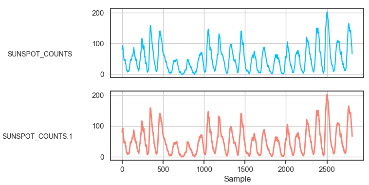
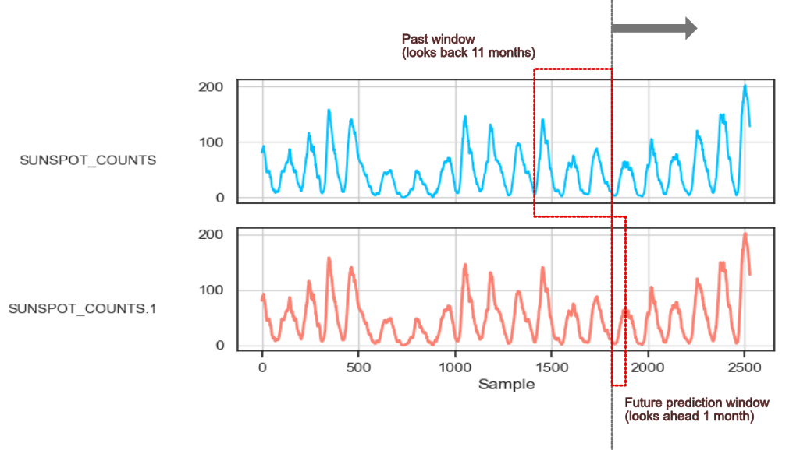
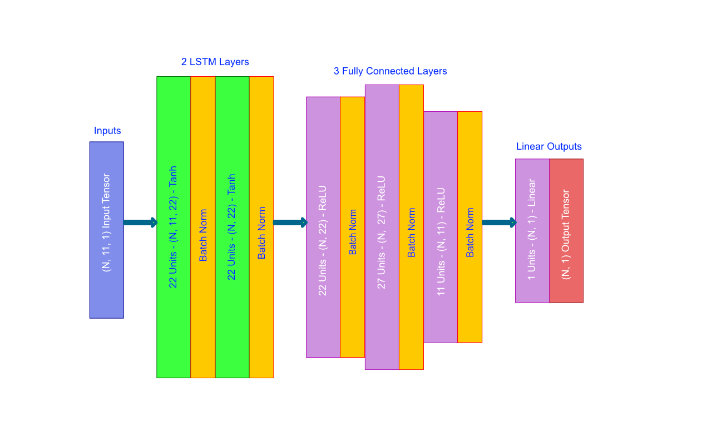
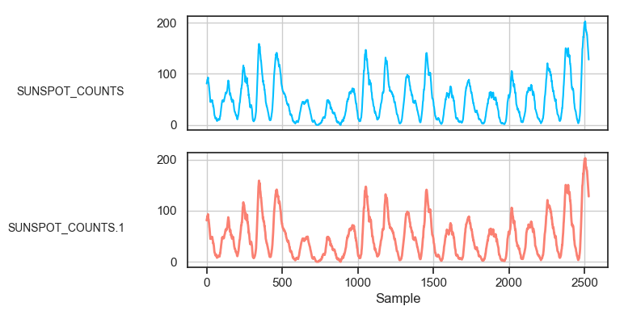
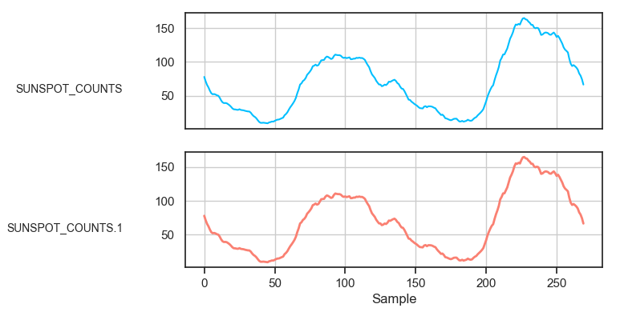
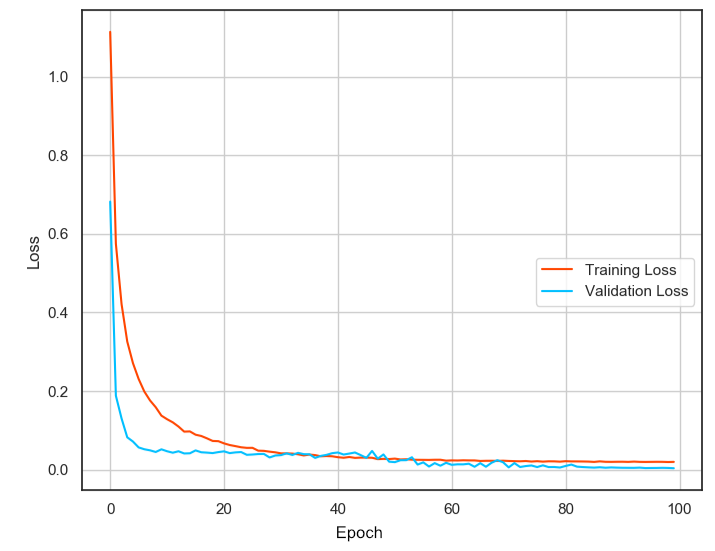

## Tutorial 1 - Forecasting Sunspot Monthly Occurrence (*Single Variable Regression*)

In this tutorial, we learn how to use [tsf](https://github.com/tuantle/tsf) tool to forecast monthly sunspot occurrences. This tutorial focuses on single variable regression modeling that will be trained using the [Zuerich monthly sunspots numbers dataset.](https://datamarket.com/data/set/22ti/zuerich-monthly-sunspot-numbers-1749-1983#!ds=22ti&display=line).

##### Raw Dataset Processing

Before we build the model and start the training, the raw CSV dataset must be processed. We need to remove all NA or missing data points and to transform or remove non-numerical data points. Next, rearrange the columns so that the first column is the Index (this column will be ignored), the next set of columns are the features, and finally the predictions column. The feature and prediction column labels can be anything.

| N   | Feature1 ... | Feature N | Prediction1 ... | PredictionN
|-----|--------------|-----------|-----------------|-------------|
| 1   |              |           |                 |             |
| 2   |              |           |                 |             |
| 3   |              |           |                 |             |

Below is the first few rows of the raw Zuerich monthly average sunspots numbers dataset downloaded from the link above.

| Month   | Zuerich monthly sunspot average numbers 1749-1983
|---------|---------------------------------------------------|
| 1749-01 | 58.0                                              |
| 1749-02 | 62.6                                              |
| 1749-03 | 70.0                                              |
| 1749-04 | 55.7                                              |

Since we have a single variable dataset of sunspot counts over time, the processing is simple and it would look like so below where column 1 is N or the sample index, column 2 is feature, and column 3 is the prediction.

| N | SUNSPOT_COUNTS | SUNSPOT_COUNTS
|---|----------------|----------------|
| 1 | 80.9           | 80.9           |
| 2 | 82.2           | 82.2           |
| 3 | 83.3           | 83.3           |
| 4 | 84.9           | 84.9           |

To help make this dataset easier to train, a 12 months average window is applied to each data point. So each datapoint is an average of the previous 12 months. This smooth out the fluctuations and reduce the complexity in the dataset. And the plot of the processed [dataset]()



##### Setup & Training Strategy

This is a single variable regression modeling tutorial so we will only have 1 input feature to feed into our model and 1 prediction output from the model.

The training strategy is to let the model see the last 11 months of sunspot number data and and have it makes forecast for next month sunspot number.

Thus the input of the model would be a tensor of shape = (N, 11, 1), where N = batch size, 11 = past 11 months window, and 1 = feature count.

The output from the model would then be a tensor of shape (N, 1, 1), where N = batch size, 1 = next month future window, and 1 = prediction count. Since [tsf](https://github.com/tuantle/tsf) only makes prediction one period ahead, the future window size will always be 1.

Below is a visual diagram of the feature-prediction sliding windows during training (*the windows are not drawn to scale*).



And an example of the data points inside feature-prediction sliding windows. This assume batch size = 1.
Here we feed in feature data in rows 1 to 11, column 1 and expect the model to predict **SUNSPOT_COUNTS** in row 12, column 2.

| N  | SUNSPOT_COUNTS | SUNSPOT_COUNTS
|----|----------------|----------------|
| 1  | 80.9           | ...
| 2  | 82.2           | ...
| 3  | 83.3           | ...
| 4  | 84.9           | ...
| 5  | 87.6           | ...
| 6  | 88.0           | ...
| 7  | 89.4           | ...
| 8  | 88.6           | ...
| 9  | 91.7           | ...
| 10 | 93.0           | ...
| 11 | 92.2           | ...
| 12 | ...            | 84.2

##### Setup Model

Since this is a single variable dataset that is somewhat periodic and regular, a simple DNN with 2 LSMT and 3 Dense or fully connected layers should be adequate. And to improve training and reduce overfitting, we will set dropout rate at 20%, input regularization (*L1L2 regularization at input layer*) at 0.015 and enable batch normalization for input and hidden layers.

And below is the architecture diagram of the model generated by [tsf](https://github.com/tuantle/tsf).



The number of LSTM units and Dense units are automatically determined by [tsf](https://github.com/tuantle/tsf) based on the number of features and predictions. To hand pick these unit sizes, you can modification to [compiler.py](src/compiler.py) at lines 235 - 250. ReLU activation is used for Dense layer and Tanh for LSTM as default with Adam optimizer. The weights for every layers are initialized with Glorot random normal.

Here is the console run command to compile the model to HDF5 with Keras & Tensorflow backend.

```
python3 tsf.py -a compile -o mse -m examples/sunspot/models/model_23_11_11 -rl 2 -dl 3 -ir 0.015 -dr 0.2 -bn -w 11 -f 1 -p 1 -v
```
```
Params desc:
-a compile      # Do model compilation
-m ""           # Output compiled model filename
-o mse          # Use mean square error as model objective loss function
-opt adam       # Using Adam optimizer
-rl 2           # Building 2 recurrent (lstm) layers
-dl 3           # and 3 fully connected (dense) layers
-w 11           # We want to look back at the past 11 months, so the window is 11
-dr 0.2         # 20% dropout rate.
-ir 0.015       # input layer l1l2 regularization value set at 0.015
-bn             # Enable batch normalization
-f 1            # 1 input feature
-p 1            # 1 output prediction
-v              # show model summary at the end
```

And below is the model summary after compilation.

```
_________________________________________________________________
Layer (type)                 Output Shape              Param #
=================================================================
lstm_input_layer (LSTM)      (None, 11, 22)            2112
_________________________________________________________________
activation_1 (Activation)    (None, 11, 22)            0
_________________________________________________________________
batch_normalization_1 (Batch (None, 11, 22)            88
_________________________________________________________________
lstm_output_layer (LSTM)     (None, 22)                3960
_________________________________________________________________
activation_2 (Activation)    (None, 22)                0
_________________________________________________________________
batch_normalization_2 (Batch (None, 22)                88
_________________________________________________________________
dense_input_layer (Dense)    (None, 22)                506
_________________________________________________________________
activation_3 (Activation)    (None, 22)                0
_________________________________________________________________
batch_normalization_3 (Batch (None, 22)                88
_________________________________________________________________
dropout_1 (Dropout)          (None, 22)                0
_________________________________________________________________
dense_hidden_layer_1 (Dense) (None, 27)                621
_________________________________________________________________
activation_4 (Activation)    (None, 27)                0
_________________________________________________________________
batch_normalization_4 (Batch (None, 27)                108
_________________________________________________________________
dropout_2 (Dropout)          (None, 27)                0
_________________________________________________________________
dense_hidden_layer_2 (Dense) (None, 11)                308
_________________________________________________________________
activation_5 (Activation)    (None, 11)                0
_________________________________________________________________
batch_normalization_5 (Batch (None, 11)                44
_________________________________________________________________
dropout_3 (Dropout)          (None, 11)                0
_________________________________________________________________
dense_output_layer (Dense)   (None, 1)                 12
_________________________________________________________________
activation_6 (Activation)    (None, 1)                 0
=================================================================
Total params: 7,935
Trainable params: 7,727
Non-trainable params: 208
_________________________________________________________________
```

##### Train Model

For training, we are going to split the dataset into 2 parts, 10% will be for validation and 90% for training.

Training dataset.



Validation dataset.



We will train the model for 100 epoch with batch size = 128 and initial learning rate at 0.002. Learning rate step decay annealing is automatically apply by [tsf](https://github.com/tuantle/tsf) during training. Start the training with the command below.

```
python3 tsf.py -a train -ds examples/sunspot/datasets/training_dataset.csv -m examples/sunspot/models/model_23_11_11.h5 -vs 0.5 -w 11 -f 1 -p 1 -ep 100 -b 128 -ilr 0.002 -v
```
```
Params desc:
-a train        # Do model training
-vs 0.1         # Validation / training dataset split at 10% and 90%
-w 11           # Past 11 months window
-ep 100         # Setting epoch at 100
-b 128          # Setting batch size at 128
-ilr 0.002      # Starting learning rate at 0.002
-f 1            # 1 input feature
-p 1            # 1 output prediction
-v              # Show plots and results
```

Here is the training & validation loss after 100 epochs.



##### Results

Here is the output results from excecuting ```tsf.py -a train...``` of the validation dataset. The expected and predicted sunspot number are plot on top of each other. The prediction results is decent with a relatively simple model and can be further improved with hyper parameters tuning.


----

[Next Tutorial - Forecasting Air Quality (*Multi-Variable Regression With Auto Features Extraction*)](https://github.com/tuantle/tsf/tree/master/examples/air_quality/tutorial.md)
